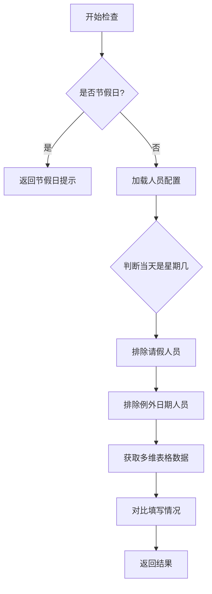

# 飞书多维表格功能说明

## 🎯 核心功能

### 1. 节假日自动判断
系统会自动识别以下情况并跳过检查：
- ✅ **法定节假日**（国庆、春节、劳动节等）
- ✅ **周末**（周六、周日）
- ✅ **调休工作日**自动识别

**数据源**: 使用 [Timor API](https://timor.tech/api/holiday) 获取中国节假日数据
- 自动fallback到本地判断（只判断周末）

### 2. 例外日期支持
支持为个人设置例外日期（固定某天不需要填写）：

```json
{
  "id": "015",
  "name": "滕凯",
  "exceptions": ["星期二"],  // 每周二无需填写
  "off": false
}
```

**支持的例外格式**：
- `"星期一"`, `"星期二"`, ..., `"星期日"`

### 3. 请假状态管理
通过 `off` 字段标记请假状态：

```json
{
  "id": "001",
  "name": "刘安营",
  "exceptions": [],
  "off": true  // true = 请假，false = 正常
}
```

## 📋 配置文件说明

### people.json 结构

```json
{
  "people": [
    {
      "id": "001",
      "name": "刘安营",
      "exceptions": [],        // 例外日期（星期几）
      "off": false             // 是否请假
    },
    {
      "id": "015",
      "name": "滕凯",
      "exceptions": ["星期二"], // 每周二不来
      "off": false
    }
  ]
}
```

## 🚀 使用示例

### 基础用法

```python
from utils.feishu.client import FeishuClient
from utils.feishu.bitable import BitableAPI

# 初始化
feishu_client = FeishuClient(app_id="xxx", app_secret="xxx")
bitable = BitableAPI(
    client=feishu_client, 
    url="https://xxx.feishu.cn/base/xxx?table=xxx&view=xxx"
)

# 检查填写情况（自动从配置文件读取）
result = bitable.check_users_filled(date_str="2025-09-30")
```

### 返回结果

```python
{
    'all_filled': bool,        # 是否全部填写
    'filled': [...],           # 已填写的人员列表
    'not_filled': [...],       # 未填写的人员列表
    'on_leave': [...],         # 请假的人员列表
    'exception_day': [...],    # 例外日期的人员列表
    'is_holiday': bool,        # 是否为节假日
    'fill_rate': float,        # 填写率（不含请假和例外）
    'message': str             # 节假日提示信息（仅is_holiday=True时）
}
```

### 判断逻辑

```python
if result['is_holiday']:
    print(f"今天是节假日，无需检查")
    
elif result['all_filled']:
    print("✅ 所有人都已填写！")
    
else:
    # 发送提醒给未填写人员
    for name in result['not_filled']:
        send_reminder(name)
```

## 🔧 高级功能

### 1. 手动指定检查人员

```python
# 不使用配置文件，手动指定人员
result = bitable.check_users_filled(
    user_names=["石国艳", "徐晓东", "胡东利"],
    date_str="2025-09-30"
)
```

### 2. 跳过节假日检查

```python
# 强制检查（即使是节假日）
result = bitable.check_users_filled(
    date_str="2025-10-01",
    skip_holiday_check=True
)
```

### 3. 自定义配置文件路径

```python
result = bitable.check_users_filled(
    date_str="2025-09-30",
    config_path="/path/to/custom/people.json"
)
```

## 📊 工作流程



## 🎨 实用工具函数

### 获取星期几

```python
weekday = BitableAPI.get_weekday_name("2025-09-30")
# 返回: "星期二"
```

### 判断是否节假日

```python
is_holiday = BitableAPI.is_holiday("2025-10-01")
# 返回: True（国庆节）
```

### 加载人员配置

```python
# 自动排除请假和例外日期人员
people = BitableAPI.load_people_from_config(date_str="2025-09-30")
```

## 📝 测试文件

### test_bitable.py
基础功能测试，检查指定日期的填写情况

```bash
python backend/playground/test_bitable.py
```

### test_holiday_exception.py
完整测试套件，包括：
- 多日期测试（工作日、周末、节假日、例外日期）
- 节假日API测试
- 例外日期配置测试

```bash
python backend/playground/test_holiday_exception.py
```

## 🛠️ 常见问题

### Q: 节假日API访问失败怎么办？
A: 系统会自动fallback到本地判断，只识别周六周日为周末。

### Q: 如何添加新的例外日期？
A: 在 `people.json` 中对应人员的 `exceptions` 数组添加星期几即可。

### Q: 如何标记某人请假？
A: 将对应人员的 `off` 字段设置为 `true`。

### Q: 可以同时设置请假和例外日期吗？
A: 可以，但请假优先级更高（请假时无论哪天都不检查）。

## 📌 注意事项

1. **日期格式**: 必须使用 `YYYY-MM-DD` 格式
2. **星期格式**: 必须使用中文 `"星期一"` ~ `"星期日"`
3. **配置文件**: 确保 `people.json` 格式正确且有 `people` 数组
4. **API限流**: 节假日API有访问限制，频繁调用可能失败（会自动fallback）

## 🔄 更新日志

### v2.0 (2025-10-21)
- ✅ 新增节假日自动判断功能
- ✅ 新增例外日期支持（固定某天不需要填写）
- ✅ 增强请假管理（`active` → `off`）
- ✅ 优化返回结果结构
- ✅ 添加多场景测试套件

### v1.0
- ✅ 基础多维表格读取功能
- ✅ 人员填写状态检查
- ✅ 请假人员管理

